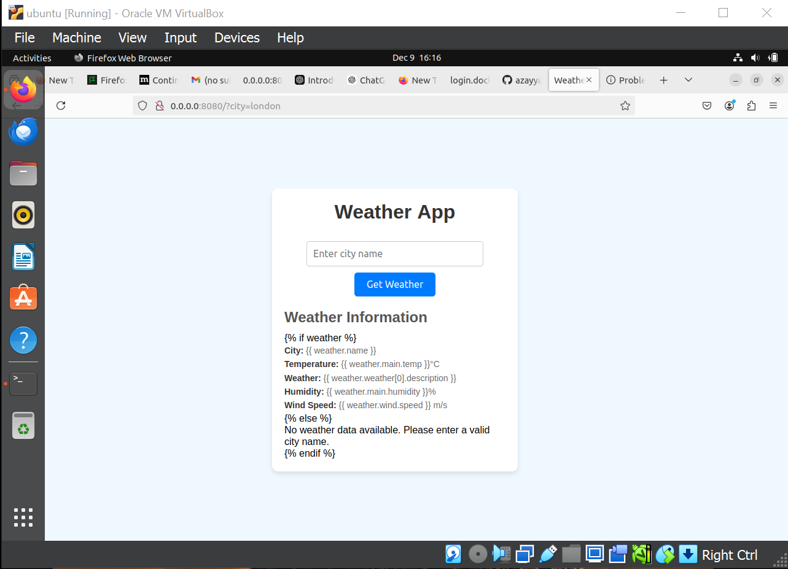

# Weather Application - Containerization and Container Orchestration

This project demonstrates the process of containerizing a simple weather application and orchestrating it using Kubernetes. The application involves creating a simple web app, containerizing it with Docker, and deploying it to a Kubernetes cluster using `Kind` (Kubernetes in Docker).

## Table of Contents
1. [Project Setup](#project-setup)
2. [Task 1: Project Directory Setup](#task-1-project-directory-setup)
3. [Task 2: Initialize Git](#task-2-initialize-git)
4. [Task 3: Git Commit](#task-3-git-commit)
5. [Task 4: Dockerize the App](#task-4-dockerize-the-app)
6. [Task 5: Push to Docker Hub](#task-5-push-to-docker-hub)
7. [Task 6: Set Up a KIND Kubernetes Cluster](#task-6-set-up-a-kind-kubernetes-cluster)
8. [Task 7: Deploy to Kubernetes](#task-7-deploy-to-kubernetes)
9. [Task 8: Create a Kubernetes Service](#task-8-create-a-kubernetes-service)
10. [Task 9: Access the App](#task-9-access-the-app)

---

## Project Setup

### Task 1: Project Directory Setup

 **1.1 Created a new project directory called `weather-application`**  
   I created a new project directory named `weather-application` to hold the application files and configurations.
   
 **1.2 Created `index.html` and `styles.css` files**  
   Inside the `weather-application` directory, I created an `index.html` file and a `styles.css` file for the frontend web app.

### Task 2: Initialize Git

 **2.1 Initializing a Git repository**  
   I initialized a Git repository in the `weather-application` directory to start version control for the project.

### Task 3: Git Commit

 **3.1 Added and committed the initial code**  
   I added the `index.html` and `styles.css` files and committed the changes to the Git repository.

### Task 4: Dockerize the App

 **4.1 Create a Dockerfile specifying Nginx as the base image**  
   I created a `Dockerfile` to containerize the app, using the official `nginx` image as the base. This allows us to serve the static web app.

 **4.2 Copy the HTML and CSS files into the Nginx directory**  
   I configured the Dockerfile to copy the `index.html` and `styles.css` files into the Nginx container’s HTML directory.

### Task 5: Push to Docker Hub

 **5.1 Logged into Docker Hub**  
   I logged into my Docker Hub account to push the containerized image.

 **5.2 Pushed the Docker image to Docker Hub**  
   I built the Docker image and pushed it to my Docker Hub repository.

 **5.3 Pushed the Dockerfile and other files to my GitHub repo**  
   I also pushed the `Dockerfile` and other related project files to my GitHub repository for version control.

### Task 6: Set Up a KIND Kubernetes Cluster

 **6.1 Installed KIND (Kubernetes in Docker)**  
   I installed KIND, a tool for running Kubernetes clusters in Docker containers, to simulate a Kubernetes environment locally.

 **6.2 Created a KIND cluster**  
   I created a Kubernetes cluster using KIND to deploy the application.

### Task 7: Deploy to Kubernetes

 **7.1 Created a Kubernetes deployment YAML file specifying the image and desired replicas**  
   I created a Kubernetes `deployment.yaml` file to define the deployment, specifying the Docker image and the number of replicas.

 **7.2 Applied the deployment to the cluster**  
   I applied the deployment to the Kubernetes cluster to create the Pods and deploy the application.

 **7.3 Pushed the deployment.yaml to my GitHub repo**  
   I pushed the `deployment.yaml` file to my GitHub repository for version control.

### Task 8: Create a Kubernetes Service

 **8.1 Created a Kubernetes service YAML file specifying the type as `ClusterIP`**  
   I created a `service.yaml` file to expose the application inside the Kubernetes cluster using the `ClusterIP` service type.

 **8.2 Applied the service to the cluster**  
   I applied the service to the cluster to expose the app internally to the Kubernetes network.

 **8.3 Pushed the service YAML file to my GitHub repo**  
   I pushed the `service.yaml` file to my GitHub repository for version control.

### Task 9: Access the App

 **9.1 Port-forwarded the service to access the app locally**  
   I used `kubectl port-forward` to forward the service's port to my local machine so that I could access the application through my browser.

 **9.2 Opened the browser and visited the specified port to view the simple frontend app**  
   After port-forwarding, I accessed the application on `http://localhost:8080` in my browser to view the simple frontend app.

---

## Conclusion

This project demonstrates the complete flow of containerizing an application, pushing the container to Docker Hub, deploying it to a Kubernetes cluster using KIND, and accessing it through port forwarding. By using Docker for containerization and Kubernetes for orchestration, this project showcases the process of modern application deployment and management.

---

## Tools and Technologies Used

- **Docker**: For containerizing the weather application.
- **Nginx**: Used as the web server to serve the static files.
- **Kubernetes (KIND)**: Used for orchestrating the containers in a local cluster.
- **Git/GitHub**: Used for version control and repository management.

